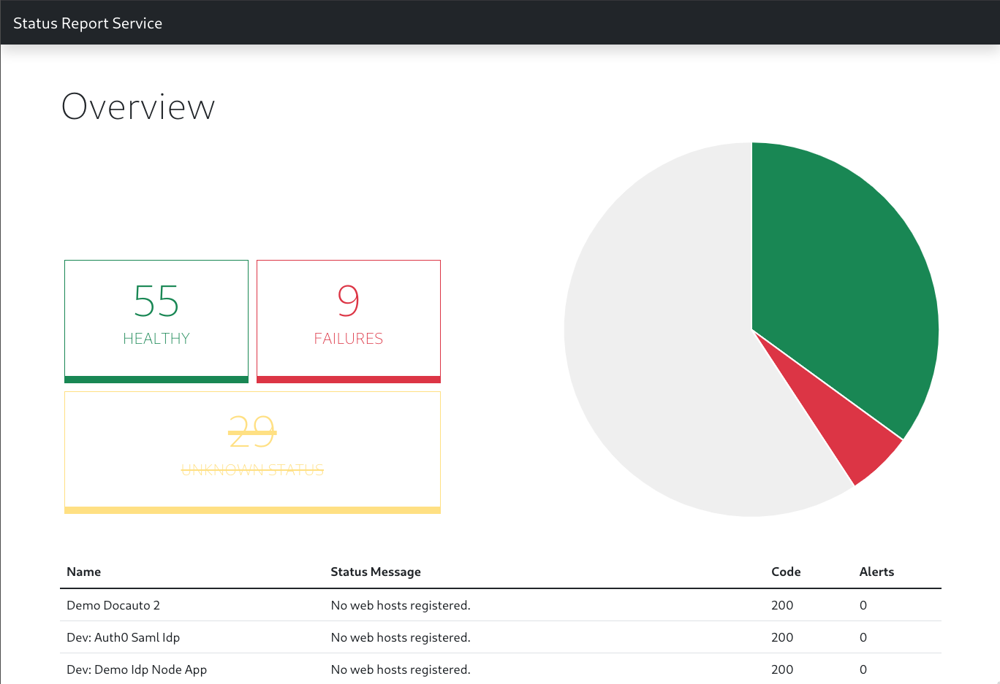

# Status Report Service

## Quickstart

```sh
# install dependencies:
$ npm install

# run the app:
$ DEBUG=status-report-service:* npm start
```

Then load http://localhost:3000/ in your browser to access the app.

## Context

**Story**

As a web user, I want to be able to see a birds-eye view of current service status.

**Technical constraints**

- Node v12
- Express 4
- NPM, Grunt
- HTML5, SCSS, CSS
- Native ES5 (client-side) JavaScript (No transpilers)
- Native ES6/7/8 (server-side) JavaScript (No transpilers)
- jQuery

**Required environment**

- AUTH_ENDPOINT
- AUTH_CLIENT_ID
- AUTH_CLIENT_SECRET
- REPORTS_ENDPOINT

## Security Model

The `status-report-service` provides all data to the frontend via a global state variable (`WSD_APP_STATE`) and HTML. Therefore a portion of data is exposed to the client without any authorization.

To mitigate the effect of **exposing sensible data**, I recommend to deploy the service within a private/closed network.

## Presentation

### Data

During the course of understanding of the gathered data, I chose to group the `status_reports` by `status_codes` and labeled them in a more meaningful sense.

Which is in my opinion the most useful data collection to a non-technical user.

```js
{
  200: 'Healthy',
  500: 'Failures',
  501: 'Unknown Status',
  403: 'Authorization', // excluded
  ECONNREFUSED: 'Disconnected', // excluded
}
```

### Frontend

The mentioned data is presented in a Pie chart by utilizing [Chart.js](https://www.chartjs.org/), which provides a rich feature-set and a intuitive developer expierience.
Additionally a table is used to get a more detailed information about the status of a service.

---


